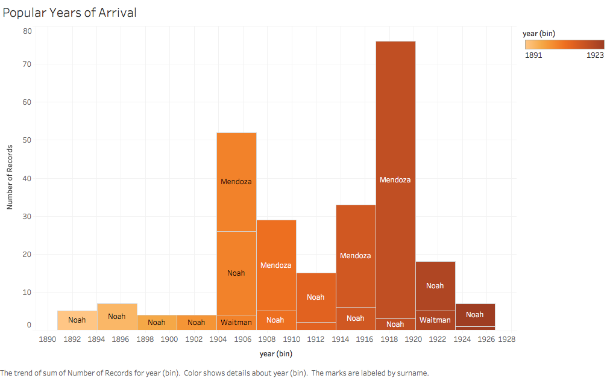
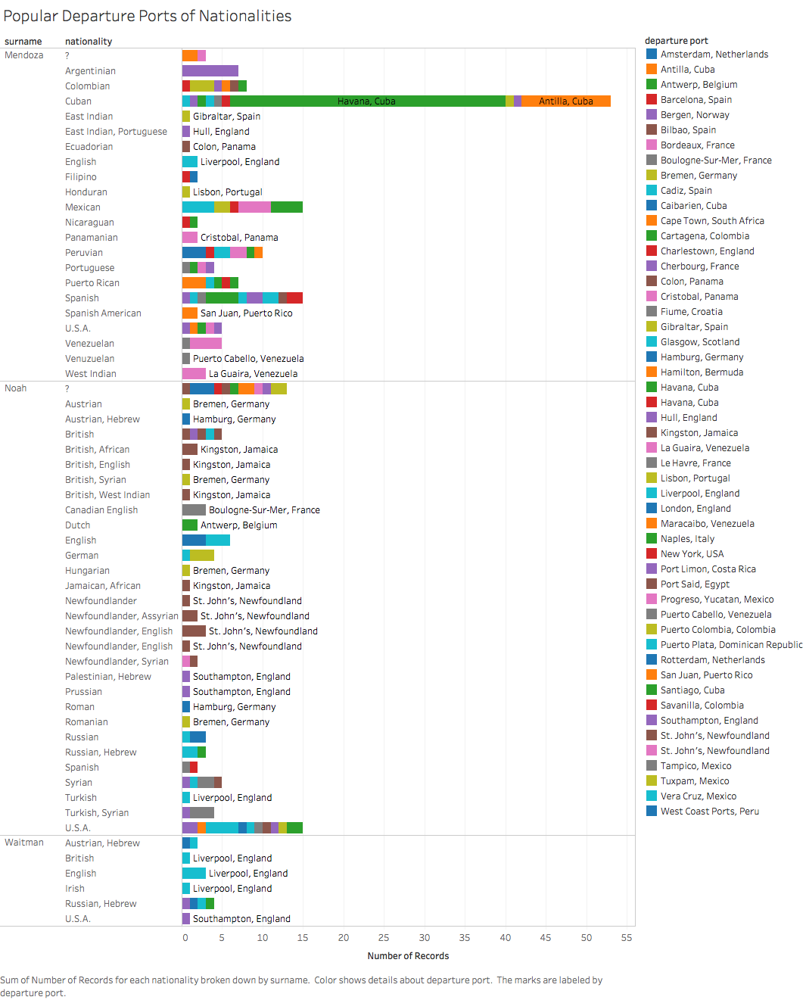
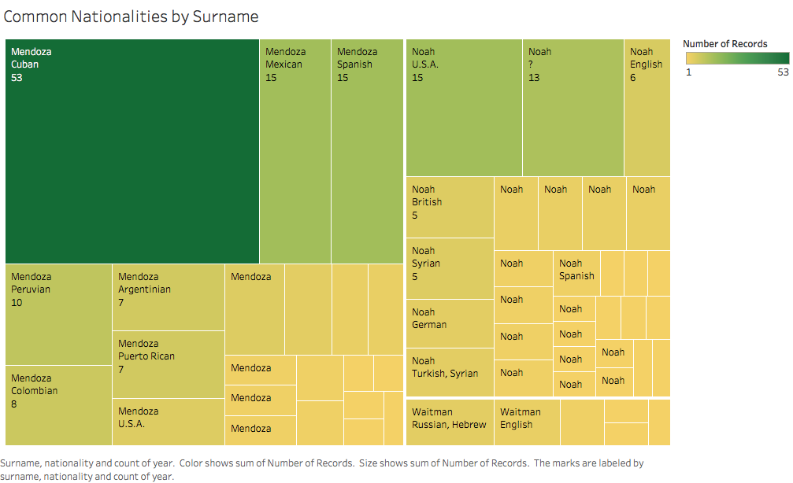
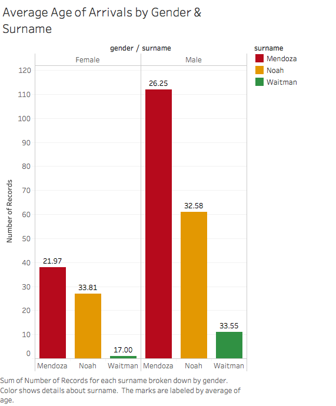

# Data Charts

For the data of this project three names were picked out of the many who emmigrated to the United States, the names include Mendoza, Waitman and Noah.

For the first find the data surrounding the three names displayed that there was a stretch of time that immigrationm was more frequent, during the years of 1918-1920

Even with so many different ports in which these immigrants left from.  In this data the three names were used and it was discovered that the port of Cuba was surprisingly one of the more common ports that immigrants arrived from.

The name Mendoza is the most common of the three names among the immigrants who entered the United States during the years in questio.  Looking further into this, the next step was to look at the most common nationalities of each of the three names.

After finding out which name of the three was the most common among the immigrants, the next tidbit of information that neede to be located was the average age of the people entering the United States with one of the names that were picked at the beginning of the project.  What was discovered was that the males who emmigrated to the United States were all around the same age 26-33 where as the females who emmigrated the age discrepency was much higher.

