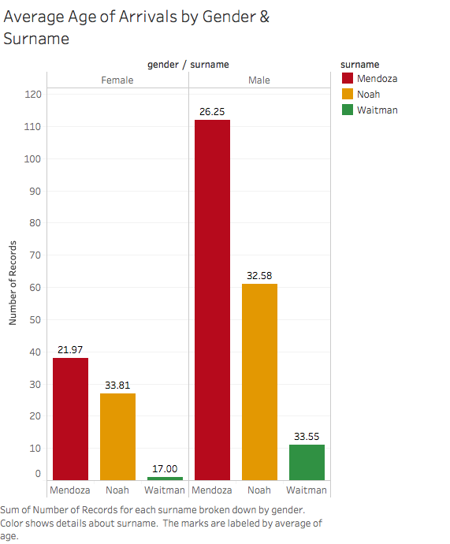
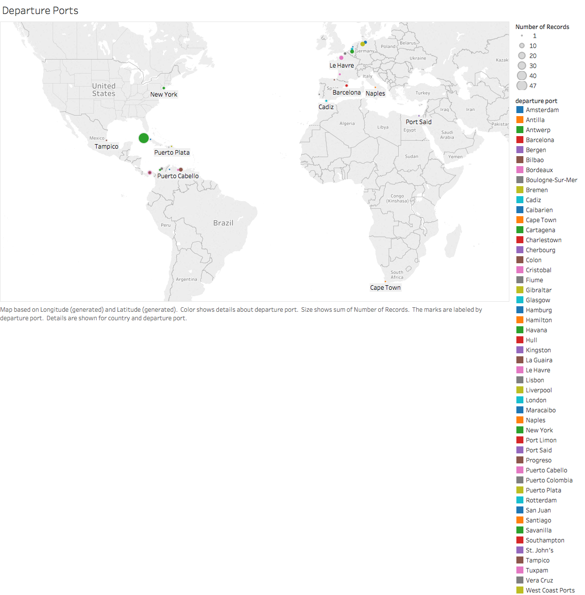
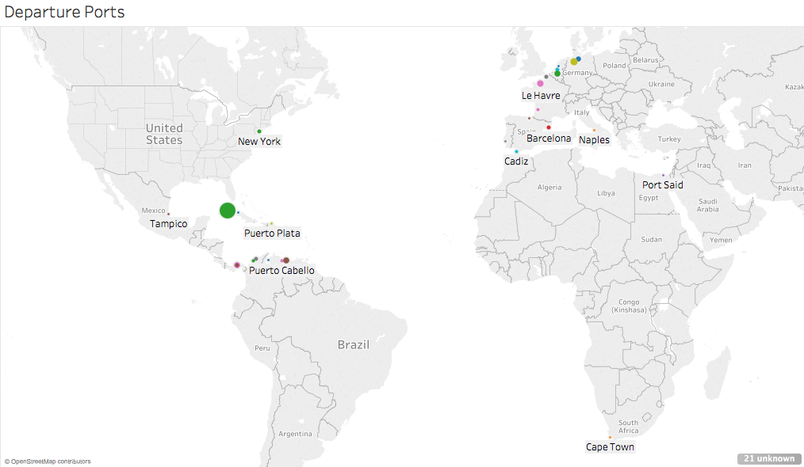

# Data Charts

For the data of this project three names were picked out of the many who emmigrated to the United States, the names include Mendoza, Waitman and Noah.

For the first find the data surrounding the three names displayed that there was a stretch of time that immigrationm was more frequent, during the years of 1918-1920

Pictured is the sum of the number of records (250) for each surname divided by gender. The colors and bars show the details about each surname and the marks are labeled by the average age of the passengers. As shown, the average age for Mendoza (red) female passengers (left) is 22 years and for males (right) it is 26 years.
The average ages of female and male Noah arrivals (yellow) are 34 and 33, respectively, and the average ages of Waitman female and male passengers (green) are 17 and 34, respectively. Among the disparities in this image is that there is only one female Waitman passenger in the dataset,
so it is an exact rather than an average age numeral listed.
Additionally, some of the passengers’ ages are not identified (indicated by a question mark on the data sheet) and are therefore not factored into these results.
Another discrepancy is that Tableau recognizes the ages as numerical values rather than numbers of years, so it included decimals to produce the averages.
As a result, decimals were rounded up or down depending whether they were higher or lower than 0.5, in order to create whole numbers for the ages.
Lastly, the Mendoza average ages reflected are based only on the number of records (150) included in the dataset.

This depiction serves to show the total number of records, categorized by the different nationalities within each surname and the numerous departure ports they used.The colors indicate each departure port, and the marks are labeled by departure port. This visualization emphasizes that nationalities exited through various ports across the globe and not solely through the ports within their respective homelands.

The image reveals the commonness of specific passenger nationalities per surname. The surnames, nationalities and amount of passengers per nationality are labelled in each box, and the sizes and colors of each box reflects the sum of number of records per nationality.
The color spectrum intensifies and reduces accordingly with the number of records; i.e., the fewer the records the lighter the box, and the greater the records the darker the box. Analyzing each surname, out of the 150 Mendoza records used (left) it is clear that the majority of immigrants were Cuban, followed by Mexican, Spanish, Peruvian, Colombian, Argentinian, Puerto Rican, etc.
Most Noah immigrants (top right) appear to be of American or unknown origin, proceeded by immigrants of British/English heritage.
For the Waitman immigrants, most were from the British Isles: English (3), British (1), Irish (1) and American (1).
One of the blatant discrepancies in this image involves immigrant records who were identified as United Statesmen, but obviously one cannot emigrate to their own country.
Checking the dataset, the Mendozas listed as American citizens came from ports in Cuba, Puerto Rico, Panama, France and England; Noah ‘American’ passengers arrived from departure ports in Puerto Rico, England, Scotland, Belgium, Germany, France, Croatia and Panama; and one Waitman identified as American came from Southampton, England. It cannot be assumed nor determined what these persons’ nationalities were since immigrants often came to Ellis Island from departure ports not within their respective homelands. Another disparity in the depiction is that not every box contains an identification or a numerical value for each nationality, presumably due to lack of space.
Consequently, this makes the majority of Waitman immigrants appear to have been Russian Jews based on box size and color, when actually most were from the British Isles.

A noticeable example is with the Mendoza Cubans who appear to have primarily used ports in Cuba such as Havana, Antilla and Santiago to migrate to Ellis Island. Nonetheless, some came from ports in Mexico, England, France and Spain.
Other clear examples are demonstrated by the Noah Syrians who came to New York from ports in England, France and Panama, as well as by the Waitman Russian Jews who departed from ports in England, the Netherlands and Belgium.
The problem with this visualization is that Tableau used the same hue to represent individual departure ports, and not every port is labelled an account of, presumably, not enough space.
This makes it difficult for the viewer to distinguish specific departure ports based on the visualization key. To elaborate, Bergen, Cherbourg, Hull, Port Limon, and Southampton are indicated by the color purple.
This makes the Mendoza Argentinians, for instance, look like they all used the same departure port when actually a portion of the purple mark represents Southampton and the other portion is Cherbourg.
Another example involves the Mendoza Mexicans. Since green is used to mark Antwerp, Cartagena, Havana, Naples and Santiago, it seems as though those immigrants used the same port, but the green bar is actually split between Havana and Antwerp.
Most of the reused colors are separated by other colors/ports, but some are not labelled, so it is hard to discern which ports are which. To explicate, brown signifies Bilbao, Colon, Kingston, Port Said and St. John’s. Looking at the Noah Britons, there are three sections of brown that represent St. John’s, Port Said, and Kingston,
but the viewer is unable to tell and/or might justifiably assume that those browns could be Bilbao and/or Colon.

This map pinpoints the global departure ports used by the immigrants in our dataset to emigrate to Ellis Island. The departure ports are: labeled and placed according to the cities and countries where each are located; indicated by different colors; and sized according to the sum of the number of records. It is evident that Havana is the most prevalent departure port, with 47 immigrants from our dataset exiting from there. This result happened due to the fact that the majority of the immigrants in our dataset are Mendozas of Latin American origin and have the most sway over the outcomes. The succeeding popular ports are Liverpool (26), Southampton (17), Antilla (11), St. John’s (11), Bremen (10), Le Havre (8), San Juan (8) and so forth. Overall, the most common countries used as exit ways were Cuba (61), England (48), France (20), Germany (15), Mexico, (12), Newfoundland (11), Panama (10) and Venezuela (10). The choice to label the ports was made on behalf of the smaller ports which are not too noticeable. Regarding errors, there are some major ones in this visualization. For starters, many ports are not portrayed, particularly those located in Great Britain, Newfoundland, Jamaica, Bermuda, Croatia, and Costa Rica. It is uncertain why Tableau neglected to position certain ports; yet, listed them on the key. In this case, it did create a setback in what the visualization is trying to convey since the purpose is to show the major and minor departure ports. Additionally, Tableau, reuses colors to represent different ports; however, it’s not a huge issue since the departure ports are situated and discerned in their respective countries. The final disparity relates to what is probably incorrect documentation where some immigrants have New York listed as their departure port. By definition, to emigrate means leave one's own country in order to settle permanently in another; therefore, it is impossible to emigrate to and from the same country.
