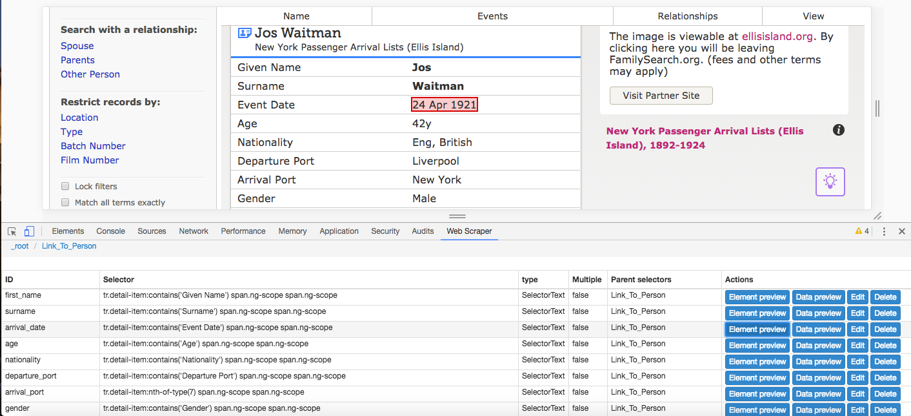
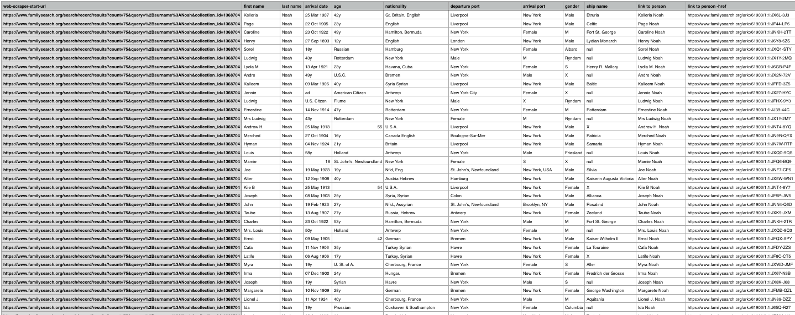
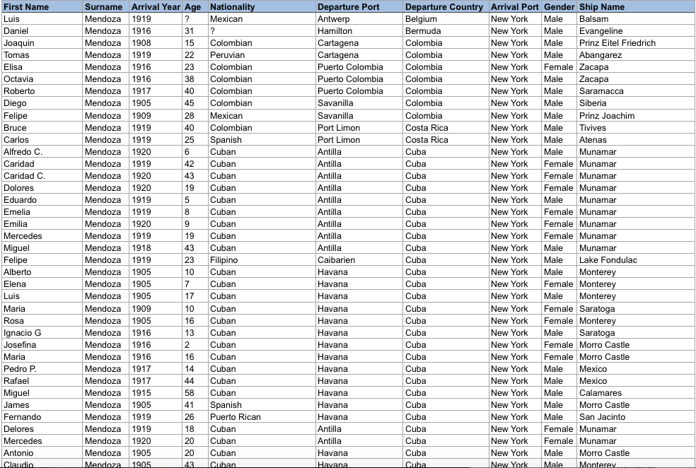
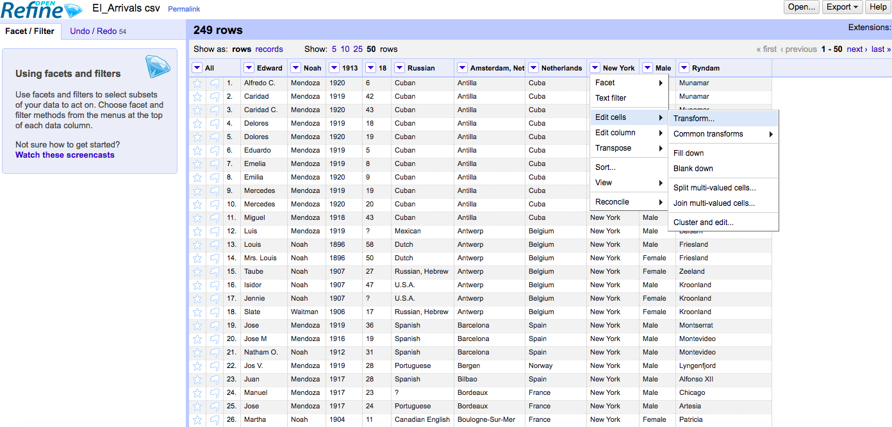
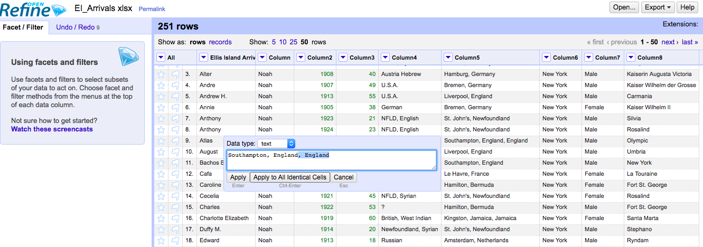

# Scraping and Scrubbing the Data

The initial attempt to scrape data using the Web Scraper tool was done with the website libertyellisfoundation.org/. The decision to use this source was based on the fact that it holds the Ellis Island Archives of passenger lists of over 51 million immigrants, passengers and crew members who entered the United States through Ellis Island and the Port of New York. Ellis Island opened and close in 1892 and 1957, respectively, and its peak period from 1892 to 1924 is noted as the largest human migration wave in modern history.

The ship companies that transported passengers kept detailed lists called “ship manifests” where information about each passenger was written down. These manifests were used to inspect immigrants upon arrival in the United States. The Church of Jesus Christ of Latter-day Saints, which sponsors the site familyseach.org, transcribed these manifests into a vast digitized archive that can navigated for free in search of an individual passenger.

The Ellis Island Archives contain passenger records that provide information such as passenger name, nationality, date of arrival, age at arrival, gender, martial status, ship of travel, port of departure and more. The U.S. government in the 1940s had the original ship manifests microfilmed in storage prior to discarding them. Consequently, Ellis Island’s database has the historical manifests scanned from the original microfilms that reveal the same fields of information previously mentioned. The original manifests show an immigrant’s original name, last place of residence, passenger companions and their location, and other information. Additionally, one can find over 900 ship images as well as the history and background of each ship that brought immigrants to America.

The Passenger Search page requires you to type at least the first two initials of or an entire last name into the search engine. This will provide exact matches, unless otherwise specified. It was attempted to conduct passenger searches of all Turkish immigrants. Due to the website’s requirements (providing a full surname of the first two letters) and restrictions (if you type in ‘Aa,’ exact matches of people named Aa or whose last names contain double As will appear instead of a list of people whose names began with A), it was impossible to retrieve all Turkish passengers through an alphabetical order search (A-Z) of their last names.

Ultimately, it was decided that each group member’s surname would be used to perform the research, as well as to focus the time frame on the height of Ellis Island (ca. 1892 to 1924). Moreover, since the Mendoza surname generated an enormous database of 760 exact matches and there were just 12 Waitmans and 88 Noahs (100 combined), it was decided to choose only  150 Mendoza immigrants to make the dataset more digestible.

By clicking “one page form,” you may narrow your search on the Passenger Result page by checking the filter, gender, and marital status boxes. You may also adjust the search by passenger year of birth; age at arrival; month, day and/or year of arrival; and/or his or her current age. Furthermore, the site allows you to enter the ship name, port of departure, name of town, place of birth, and/or companion first name of passengers. The last option offers the ability to refine your search by selecting one or multiple ethnicities. Your results appear by category (exact matches, alternate spellings, close matches, etc.), with the names listed reflecting the category highlighted in blue.

Your passenger search results appear in a list view. You may roll over the ‘i’ image to the left of each name to enlarge sections of the manifest. If you want more in-depth information, you may click on one of the three images under the ‘Action’ column to access the passenger record, ship image and ship manifest. If you discover the record is not the person you are looking for and want to return to the list of results, you must click the ‘Results’ arrow to the right of the ‘Last Name’ field at the top of the page instead of the browser-back button.

Unfortunately, because of how the Ellis Island database is designed, it requires using a complicated scraping method that was not taught in order to retrieve the data. As a result, an alternative source was used.

As mentioned previously, FamilySearch holds the “New York Passenger Arrival Lists (Ellis Island), 1892-1924” collection (link: https://www.familysearch.org/search/collection/1368704?collectionNameFilter=true). It includes an index of the 25 million immigrants and other persons who arrived at Ellis Island and the Port of New York between 1892 and 1924. In addition, the images are linked to the Statue of Liberty-Ellis Island partner site, located in the ‘View’ column of your passenger search.

FamilySearch’s database of the New York Passenger Arrival Lists (Ellis Island), 1892-1924 collection was last update on October 22, 2017. The source is served by the National Archives and Records Administration (NARA) microfilm publications T715 and M237, based in Washington, D.C.

FamilySearch works quite differently from The Statue of Liberty-Ellis Island. It allows you to enter either just a first name, a surname, or both, and will automatically search and generate all results related to what is entered in the field(s). If you check the blank box at the end of the given fields, the results will provide exact matches. Moreover, the time frame of the collection is already reduced to the years in question (1892-1924), so no further steps were necessary.

I started gathering the data using my last name. I typed ‘Waitman’ into the last name field and clicked the box at the end of that field for exact matches. I created a sitemap called ‘waitman’ and entered the proper URL (https://www.familysearch.org/search/collection/results?count=50&query=%2Bsurname%3AWaitman&collection_id=1368704). A list of 12 immigrants with the Waitman surname and their links came up, and I could begin scraping.

I opened Web Scraper (command + option + i for MacBooks) and clicked on the first person listed, Jos Waitman, which revealed his information card. The digital card included information regarding his given (first) name, surname, event (arrival) date, age (of arrival), nationality, departure port, arrival port, gender and ship name. I made (nine) ‘text’ selectors with those IDs, and selected their respective elements on the digital card. I then created a ‘link’ selector titled ‘Link_To_Person.’ I proceeded to select the proper element, or the links of the first and second passengers (Jos and Job in this example), which then highlighted the names/links of the remaining passengers on the page, checked the ‘Multiple’ box and save the selector.

After those steps were accomplished, I went into each of the other nine selectors (first_name, surname, arrival_date, age, nationality, departure_port, arrival_port, gender and ship_name) and changed their parent selector from ‘_root’ to ‘Link_To_Person,” then hit the ‘save selector’ button at the bottom. Once those selectors were stored in the ‘Link_To_Person” selector, I clicked on the ‘Sitemap’ tab and selected the ‘Scrape’ option. [FYI: You can click on the ‘Element preview’ and ‘Data preview’ buttons for each sector to make sure they contain their respective material before scraping.]

When Web Scraper finished, I exported the data as a CSV (option under ‘Sitemap’). I repeated the scraping process for the other group members’ surnames to retrieve the data of the (150) Mendoza and (88) Noah immigrants. This was simple since after creating the format to scrape the site (i.e., the nine text selectors housed within the link selector ‘Link_To_Person” which acts as the text selectors’ ‘parent’), all I had to do was click ‘Edit metadata,’ an option under the ‘Sitemap’ tab, and change the sitemap name and URLs, respectively (e.g., ‘Sitemap name = Mendoza, ‘Start URL’ = https://www.familysearch.org/search/record/results?count=50&query=%2Bsurname%3AMendoza&collection_id=1368704&offset=600), hit the ‘Save Sitemap’ button, scrape the site and export the data as a CSV.

Though scraping the FamilySearch database was successful, major setbacks still occurred. Considering that I had a specific layout for scraping data from each individual and not every passenger has the same information listed, there were glitches in the CSV file. To elaborate, some passengers’ information was shifted forward a column, or the data of adjacent columns (such as arrival date and age, departure and arrival port, and/or arrival port and gender) had merged. Also, some passengers have more or less data than others, so some selector categories chosen were supplemented by extraneous material such as marital and citizenship statuses and/or last place of residence. Other glitches were minor, such as the CSV containing columns dedicated to the web-scraper-start-url (sitemap URL), link to person (each passenger’s full name), and link to person -href (the detailed record card).

Due to those errors, it was mandatory to clean, or ‘scrub,’ the data. One way I achieved this was by manually editing the CSV. I deleted unnecessary columns, specifically web-scraper-start-url, link to person and link to person -href. Since I scraped the data for the three surnames separately, I also edited them individually before combined them into one file. I frequently went back and forth between the FamilySearch database and the dataset to correct each passenger’s information; i.e., making sure I inserted the correct ages, arrival dates, departure ports, genders, nationalities, etc for the respective persons.

Another tool I used to scrub the data was OpenRefine. Once you ‘Create (a) Project’ and upload a file, there are several ways you can clean it up. I started by using the down arrows in each column to scroll down to ‘Edit cells’ then over to ‘Transform.’ This allowed me to make fixes such as ‘value.replace(“y", “”)’ to transform ages that appeared as “21y” to just the number, or  ‘value.replace("New York, N.Y.", "New York”)’ to make ‘Arrival Port’ simply state “New York.” These ‘value’ expressions and their formats are saved into your history and can be reused.

A method I found to be easier when using OpenRefine was manually going into the file where a blue ‘edit’ button will appear per item, clicking on that edit button, making the desired changes, then hitting ‘Apply to All Identical Cells.’ This tool was incredibly useful when I had to split the departure port column into two columns of city and country, in order to plot those points in a map visualization. When you are finished, there is the option to export/convert your project into your preferred format.

