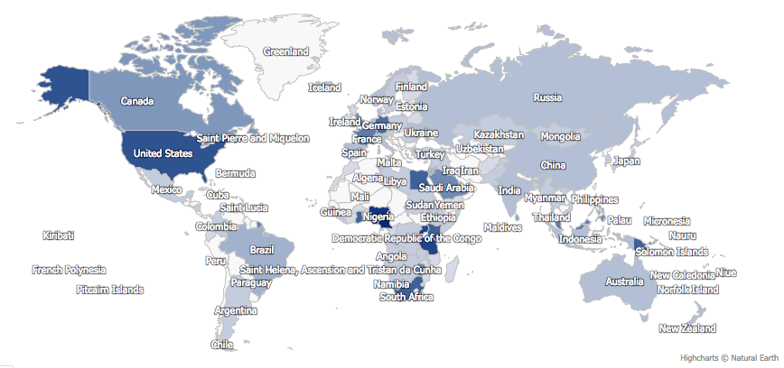
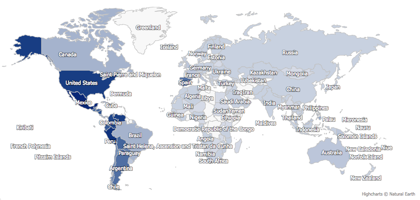
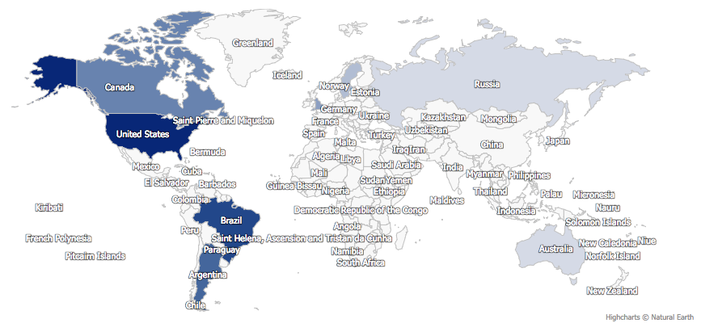

# Historiography

What was found during this research was a great deal of information that described how common each name was and from which nation they emigrated from. Some of the initial findings that were very present during the first look was the how common the name of Mendoza is during the years in question.  When looking into the number of people who held that name who had come to the United States ranged in the thousands, it was the most common of the three names picked but I could have been one of the most common names of all.  The other names selected did not have small numbers but when combined their number did not even come close to the number of Mendoza names entering the United States at this time.  The name of Waitman was the least common name among the immigrants, with the name Noah more in the middle, giving a rounded out number to make the subjects even in terms of how many are covered in the project.  What was first found is that there were a number of people with the surname Noah who hailed from Africa, in fact a large number of the people with that name come from Africa, a fact that would not have been the first guest of anyone.

This was an interesting find since the first idea of the project was to discuss colonialism in Africa, thus the project essentially went full circle.  Another great find from the information was that a great deal of the people, of all the three names came over to Ellis Island from England, when looking at the data for all the names a region in England always seems to have long lists of people emigrating from there.  This provides information that the name may not have been a great indication to where the people were living before they decided to come over to the United States to become a citizen.  The final number as far as statistics goes as follows with Mendoza being the 279th most common name among the immigrants entering Ellis Island during the years in question.  This name being a great deal more common then the other two names in question, which were both in the thousands range of less common.  What was one of the most interesting about the finds is that the people did not come from the nations that were expected, the Mendoza name came from a number of nations not just the assumed European nations, these people like those with the other names selected, all hailed from different places and they all shared names with people all across the world.  This shows how common people are to one another, it provides a standard that shows humanity is not much different from one another.

The name Waitman was the least common name of the three and this name came from places that were not expected as well

 While making this tie is a bit of a stretch, there is much that can be learned from these immigration numbers, that even though a name seems more common it may be the least common during the years when immigration was at it's hight on Ellis Island.  The only conclusions that can be made regarding some of the names may be their origin, this could play to the facts of it being more common than another.  While this does not add much in the ways of revealing a bombshell of a discovery but it does bring to light information that shows the commonality of some names and from where their family may have emigrated from.
