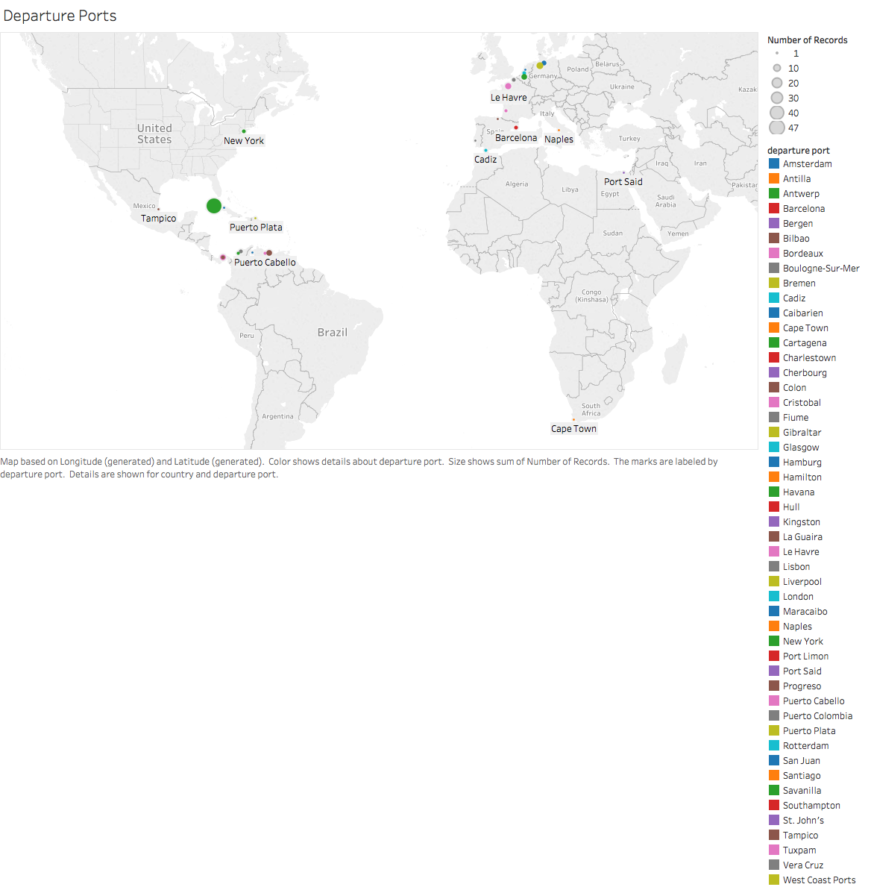

# Historiography

Immigration in the United States is something will always be a major hotbed topic even in the current year more so.  Yet this action of immigrants entering the borders of the United States has been an action being perfromed for years and from all different parts of the world.  This project covered this highly discussed topic of Immigratio yet took a different route then by commenting on the issue itself.  This investigation was more interested in where the many immigrants hailed from and how frequently more nations showed up than others.  to conduct this research topic, names would have to be selected in order to test how common each name was and from which port they sailed out of.

What was found during this research was a great deal of information that described how common each name was and from which nation they emigrated from. Some of the initial findings that were very present during the first look was the how common the name of Mendoza is during the years in question.
 When looking into the number of people who held that name who had come to the United States ranged in the thousands, it was the most common of the three names picked but I could have been one of the most common names of all.  The other names selected did not have small numbers but when combined their number did not even come close to the number of Mendoza names entering the United States at this time.

The name of Waitman was the least common name among the immigrants, with the name Noah more in the middle, giving a rounded out number to make the subjects even in terms of how many are covered in the project.  What was first found is that there were a number of people with the surname Noah who hailed from Africa, in fact a large number of the people with that name come from Africa, a fact that would not have been the first guest of anyone.

This was an interesting find since the first idea of the project was to discuss colonialism in Africa, thus the project essentially went full circle.  Another great find from the information was that a great deal of the people, of all the three names came over to Ellis Island from England, when looking at the data for all the names a region in England always seems to have long lists of people emigrating from there.  This provides information that the name may not have been a great indication to where the people were living before they decided to come over to the United States to become a citizen.

In the pursuit of seeking out knowledge on different families that bare our last name (surname) that went through Ellis Island for a better opportunity at life we had to ask ourselves what are other researchers are doing with the beginning stages of the concept of what we know today as immigrating to the states or North America. We all know the vague stories of the dreamy pearly gates of Ellis Island, and as historians we all even know the more daunting stories of the reality of the struggle to get in. What most of us do not know is the individual groups stories. How did these families come to the decision the leave all they know to try and have an opportunity in North America. Some of the researchers out there have taken different groups and shared their information. Once of the developed searches we have come across is arslanmb.org/Armenian immigrants. This group has taken data formed from the names of the ships that travelled from these Armenian countries. They have used some similar websites as we chose to use. This helped us in conformation to make sure that the choices we made on how we would grab data to reflect what we were seeking to find out. In this research groups reasoning for seeking these answers was to help piece Armenian ancestry. Some of the background for this is that since there was he Ottoman Empire and WWI these Armenians were pushed out plus were seeking ways out. These people to seek out new opportunities but as they sought new chances their history in a way was getting destroyed. The researches felt the need to try and restore some of the history of Armenian’s who have traveled to North America through Ellis Island. While this would never completely give back the documents that were destroyed during Ottoman Empire. So, they felt the need to try to fill the gap. They feel that in the case of Ellis Island this leaves a rich primary sources of historical information that would pertain to all these Armenian families that immigrated to North America. I found their method for retrieving their information very useful. While we did not have time on project to execute this form of method it shines light on how our could break down to just a specific group of people. This feels important to mention because in the beginning of developing what we should look at we discussed looking at different groups of people, such as the Dutch or Irish immigrants. Our original purpose was to look at these specific groups to try and look into their reasoning for leaving their country. We also wanted to see if we could find out where and what they first started doing when they got to North America.

This websites research started in 2011, they are examining specifically the ships that brought passengers from Armenian countries. This would have been a great way for our project to achieve specific groups. With the way the websites that are primarily best to scrap data to use work we needed to give actual last names. This kept us from being able to properly execute our original search because we did not have a specific list of last names from each group. This lead to our actual search in just using our surnames/maiden surnames to search people that came through Ellis Island. It would be assumed that they may have started in a similar pursuit. They mention the US census quite a bit they could have even drawn more last names from that. This research has used there data to begin new projects, they recently started expanding their research to seek the heritage of these people immigrating into North America. They are using a base between 75,000 and 100,000 these people immigrated before 1930, they have created software to pull their data from transcribing the records from ship to ship. These records will continue to update as more data is collected. The research is expanding into looking into more military information.
The information this research group has provided to show how they achieved their data set can be helpful for groups like ours to read. One things that was glaringly true from this set of research is that this kind of research takes a very long time, that even though we were able to give some idea to what we were trying to achieve this kind of research could have never been successfully but what this set of research shows us is that our beginning scraps was the perfect place to begin. We were able to successfully see some trends from the data based off our surnames. This research with time could have the potential to show some interesting stuff about the different groups with our different surnames and also has the potential to express what brought these different families to the states. Below I copied a bit of an example of a graph that they made based off their Armenian data set they explain what is being represented and how this is being represented.

For each surname, I have attached a "standardized" version of that surname (in brackets), typically based on the most common spelling found in North America or Europe for "western" Armenians (those from the former Ottoman Empire). Those same surnames are often transliterated differently for those immigrants from the part of Armenia formerly under Russian dominion ("eastern Armenians"), where the present-day country of Armenia exists. Since most of the Armenian immigrants to North America of the late 1800s and early 1900s were of the "western" variety, I've chosen to standardize the surnames with that dialect. This is not to say that the standardized name is more correct than other spellings; it is just a way to group names together that have the same etymology and were probably spelled the same in Armenian.

The demographic profile of the Armenian immigrants arriving in North America changed with the dynamic geopolitical events of the time. This chart shows the relative percentages of Armenian immigrants to America in each year from 1900 through 1923, broken down by sex and age (adults over 18 and minors). Prior to 1908, you see slightly around 55% men over age 18 (dark blue), with a decent mix of women (dark red), boys (light blue), and girls (light pink). With the Young Turk revolution of 1908 and the Adana massacre of 1909, the mix changed predominately to adult men. This continued until the start of WW1 in 1914. Overseas travel from Turkey for Armenians was severely constrained during the war; the relative percentages in this time period were based on much lower absolute numbers, and were primarily people who had left Turkey before the war (and genocide) for Europe or Russia. Once the war ended and travel to America resumed in 1919, you see a huge demographic shift to women and children. The few men in the mix are mostly those who were in America when the war started, going back to Turkey to bring back their surviving family members or new brides.

It seems like the best way to further reflect on Ellis Island is to look at how things have progressed in immigration. I found it interesting to learn that as ships continued to come in the more the need for rules arose. This has translated into a rich ability to see records from the past. As usual though in the world as a historian we cannot take these for complete face value. Still these documents from passengers help us to paint different pictures of the time. The most popular time periods was 1892 to 1924, but passengers were not required to truly give information till 1820. These standard forms were not the same from state to state. In knowing this we see that if we have records in the early times the amount of information we receive varies. According to Ellis Islands official site there has been estimated that during the peak time 1.25 million people were processed. As was said in the beginning some could say that this is one of the big places that are responsible for the birth of immigration as we see it today. In saying this we have to acknowledge that things have changed over the year with immigration but the reason people immigrate to the states and even the issues that citizens of the states have with immigration seem to be the same. When looking into different current issues with immigrations it seems appropriate to reflect on board control. This seem appropriate for a couple of reasons. One is because as we look into records of Ellis Island we can almost reflect on this as the beginning of labelling who was coming into our country. We started to care more and more as different cultures started flooding in. We also know that today there is no such thing as an immigrant coming in with little to no records unless they are here illegally. This in itself is filled with a laundry list of controversies. What seems to be important to keep in mind while doing a reflection like this is to know that as we begin to understand how immigration got its roots in Ellis Island and see how these rules that got put into place during these time and issues developed in these times we begin to see how this concept has evolved to what it is today. 

 The final number as far as statistics goes as follows with Mendoza being the 279th most common name among the immigrants entering Ellis Island during the years in question.

This name being a great deal more common then the other two names in question, which were both in the thousands range of less common as seen above.  What was one of the most interesting about the finds is that the people did not come from the nations that were expected, the Mendoza name came from a number of nations not just the assumed European nations, these people like those with the other names selected, all hailed from different places and they all shared names with people all across the world.  The name Waitman was the least common name of the three and this name came from places that were not expected as well

 While making this tie is a bit of a stretch, there is much that can be learned from these immigration numbers, that even though a name seems more common it may be the least common during the years when immigration was at it's hight on Ellis Island.  The only conclusions that can be made regarding some of the names may be their origin, this could play to the facts of it being more common than another.  While this does not add much in the ways of revealing a bombshell of a discovery but it does bring to light information that shows the commonality of some names and from where their family may have emigrated from.
